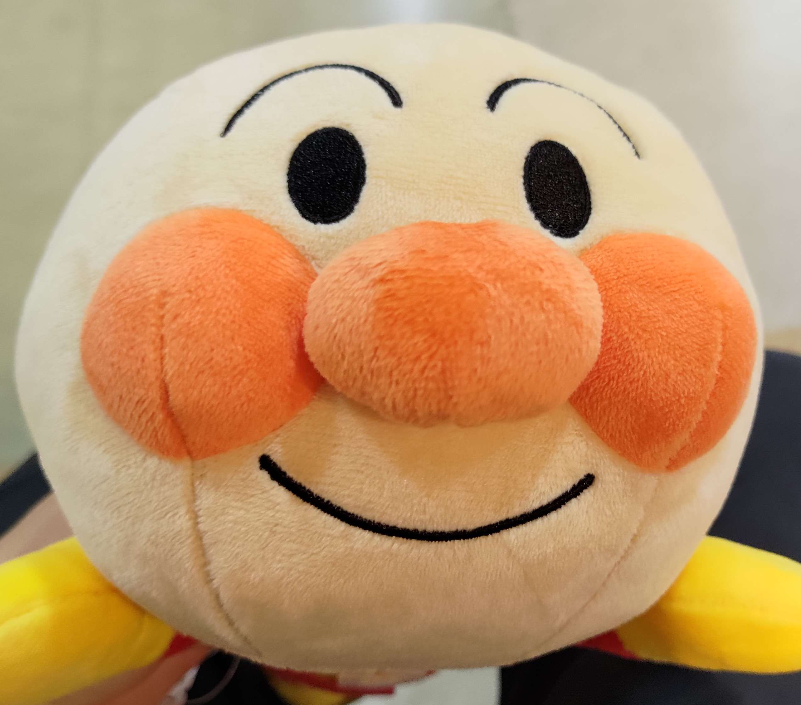

# イエモン（井ノ口雄晟）

### 自己紹介
- UEC24 2類7クラス \
- 趣味は、ゲーム（原神、wows）、スノーボード、ギター \
- 最近はlatexでプログラムを書くことにはまっています　\
- 好きなバンドは緑黄色社会、東京事変　
### 所属団体
1. [電通大無線クラブ(JA1ZGP)](https://www.ja1zgp.com/)
2. [調布祭実行委員会](https://www.chofusai.jp/)

### 保有資格
英検2級　\
第三級アマチュア無線従事者